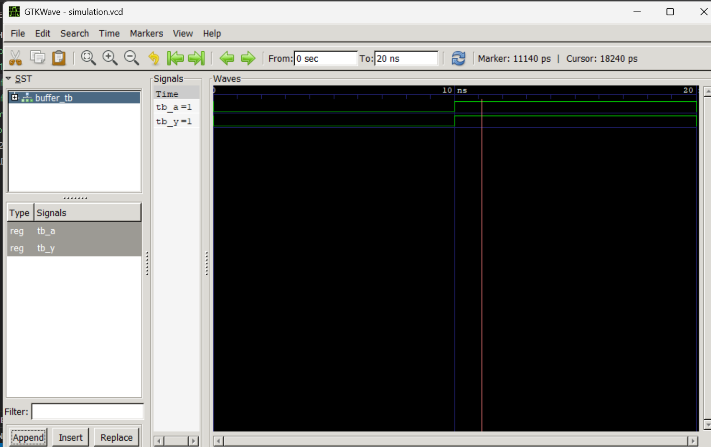

# Lab 1: Getting Started with VHDL and Simulation Tools

## Course Information

- **Course:** Computer Architecture (CMP 262)
- **Program:** Bachelor of Computer Engineering
- **Semester:** Fourth Semester
- **College:** Cosmos College of Management and Technology
- **Department:** Information and Communication Technology

---

# Aim

- To install and configure the VHDL simulation environment using VS Code, GHDL, and GTKWave.
- To understand the basic structure of a VHDL program.
- To design and simulate a simple digital circuit using VHDL.

---

# Introduction

## Overview of VHDL

VHDL (Very High Speed Integrated Circuit Hardware Description Language) is a hardware description language used to model and simulate digital electronic systems. It allows engineers to describe the behavior and structure of digital circuits before implementing them in hardware.

Unlike traditional programming languages that execute instructions one after another, VHDL supports concurrent execution, making it suitable for hardware design where multiple operations occur simultaneously.

---

# Basic Components of a VHDL Program

A standard VHDL design mainly consists of the following sections:

| Component | Purpose |
|-----------|---------|
| **Library Declaration** | Imports predefined packages and data types |
| **Entity** | Defines the input and output ports of the circuit |
| **Architecture** | Describes the internal operation or logic |

---

# Libraries Used

The IEEE library is commonly used in VHDL programs because it provides standard logic data types.

```vhdl
library IEEE;
use IEEE.STD_LOGIC_1164.ALL;
use IEEE.NUMERIC_STD.ALL;
```

### Description

- `STD_LOGIC_1164` provides the `std_logic` data type.
- `NUMERIC_STD` supports arithmetic operations on vectors.

---

# Entity Declaration

The entity block specifies the external interface of the design.

### Port Modes

| Mode | Description |
|------|-------------|
| `in` | Input signal |
| `out` | Output signal |
| `inout` | Bidirectional signal |

---

# Architecture Styles in VHDL

VHDL supports multiple design approaches:

| Style | Explanation |
|-------|-------------|
| **Behavioral** | Describes circuit behavior using processes |
| **Dataflow** | Uses concurrent signal assignment statements |
| **Structural** | Connects smaller submodules together |

For this experiment, the **Dataflow model** is used.

---

# Common Data Types

- **std_logic** → Represents a single digital signal.
- **std_logic_vector** → Represents multiple bits grouped together.

Example:

```vhdl
signal data_bus : std_logic_vector(7 downto 0);
```

---

# VHDL Simulation Procedure

The VHDL development process generally includes:

1. Writing the VHDL source code
2. Compiling the design
3. Elaborating the testbench
4. Running simulation
5. Viewing waveforms using GTKWave

---

# GHDL Commands

```bash
# Compile source and testbench
ghdl -a buffer.vhd buffer_tb.vhd

# Elaborate testbench
ghdl -e buffer_tb

# Run simulation and generate VCD file
ghdl -r buffer_tb --vcd=simulation.vcd

# Open waveform viewer
gtkwave simulation.vcd
```

---

# Design Description

## File: `buffer.vhd`

The design implements a simple buffer circuit where the output directly copies the input signal. The circuit is modeled using concurrent signal assignment.

---

# Testbench Description

## File: `buffer_tb.vhd`

The testbench verifies the functionality of the buffer circuit by applying different input values at regular time intervals.

### Applied Inputs

| Time | Input (`tb_A`) |
|------|----------------|
| 0 ns | `'0'` |
| 10 ns | `'1'` |
| 20 ns | `'0'` |

The output signal `tb_Y` is observed to confirm correct operation.

---

# Simulation Output

## File: `simulation.vcd`

The simulation generates a VCD (Value Change Dump) file which stores all signal transitions during execution. This file is viewed in GTKWave for waveform analysis.



### Result

The waveform shows that the output signal changes exactly according to the input signal, verifying the correct operation of the buffer circuit.

---

# Conclusion

In this laboratory exercise, the VHDL development environment was successfully configured using VS Code, GHDL, and GTKWave. A simple buffer circuit was designed and simulated using the Dataflow modeling style. The compilation, elaboration, and simulation processes were completed successfully. The waveform generated in GTKWave verified that the output followed the input correctly. This experiment provided a basic understanding of the VHDL design flow and simulation process.