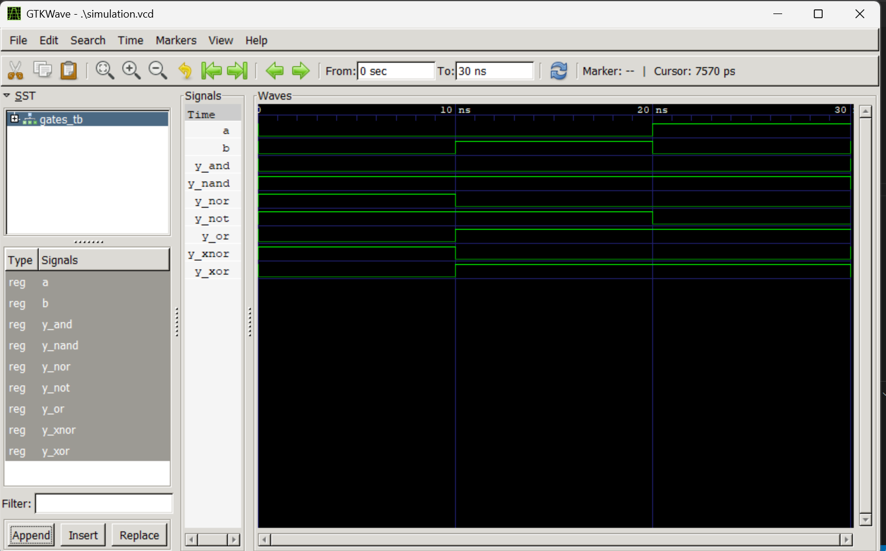

# Lab 2: VHDL Code for Realizing Logic Gates

## Course Information

- **Course:** Computer Architecture (CMP 262)
- **Program:** Bachelor of Computer Engineering
- **Semester:** Fourth Semester
- **College:** Cosmos College of Management and Technology
- **Department:** Information and Communication Technology

---

# Objective

- To write VHDL code for basic logic gates: AND, OR, NOT, NAND, NOR, XOR, and XNOR.
- To simulate each logic gate using GHDL.
- To verify the truth table outputs using GTKWave waveform analysis.

---

# Theory

Logic gates are the fundamental building blocks of digital circuits. Each logic gate performs a specific Boolean operation on one or more binary inputs to produce a binary output.

## Logic Gate Operations

| Gate | VHDL Operator | Boolean Expression |
|------|---------------|-------------------|
| AND | `and` | Y = A · B |
| OR | `or` | Y = A + B |
| NOT | `not` | Y = A̅ |
| NAND | `nand` | Y = (A · B)̅ |
| NOR | `nor` | Y = (A + B)̅ |
| XOR | `xor` | Y = A ⊕ B |
| XNOR | `xnor` | Y = (A ⊕ B)̅ |

---

# VHDL Programs

## AND Gate

### File: `and_gate.vhd`

```vhdl
library IEEE;
use IEEE.STD_LOGIC_1164.ALL;

entity AND_GATE is
    port (
        A : in std_logic;
        B : in std_logic;
        Y : out std_logic
    );
end entity AND_GATE;

architecture Dataflow of AND_GATE is
begin
    Y <= A and B;
end architecture Dataflow;
```

---

## OR Gate

### File: `or_gate.vhd`

```vhdl
library IEEE;
use IEEE.STD_LOGIC_1164.ALL;

entity OR_GATE is
    port (
        A : in std_logic;
        B : in std_logic;
        Y : out std_logic
    );
end entity OR_GATE;

architecture Dataflow of OR_GATE is
begin
    Y <= A or B;
end architecture Dataflow;
```

---

## NOT Gate

### File: `not_gate.vhd`

```vhdl
library IEEE;
use IEEE.STD_LOGIC_1164.ALL;

entity NOT_GATE is
    port (
        A : in std_logic;
        Y : out std_logic
    );
end entity NOT_GATE;

architecture Dataflow of NOT_GATE is
begin
    Y <= not A;
end architecture Dataflow;
```

---

## NAND Gate

### File: `nand_gate.vhd`

```vhdl
library IEEE;
use IEEE.STD_LOGIC_1164.ALL;

entity NAND_GATE is
    port (
        A : in std_logic;
        B : in std_logic;
        Y : out std_logic
    );
end entity NAND_GATE;

architecture Dataflow of NAND_GATE is
begin
    Y <= A nand B;
end architecture Dataflow;
```

---

## NOR Gate

### File: `nor_gate.vhd`

```vhdl
library IEEE;
use IEEE.STD_LOGIC_1164.ALL;

entity NOR_GATE is
    port (
        A : in std_logic;
        B : in std_logic;
        Y : out std_logic
    );
end entity NOR_GATE;

architecture Dataflow of NOR_GATE is
begin
    Y <= A nor B;
end architecture Dataflow;
```

---

## XOR Gate

### File: `xor_gate.vhd`

```vhdl
library IEEE;
use IEEE.STD_LOGIC_1164.ALL;

entity XOR_GATE is
    port (
        A : in std_logic;
        B : in std_logic;
        Y : out std_logic
    );
end entity XOR_GATE;

architecture Dataflow of XOR_GATE is
begin
    Y <= A xor B;
end architecture Dataflow;
```

---

## XNOR Gate

### File: `xnor_gate.vhd`

```vhdl
library IEEE;
use IEEE.STD_LOGIC_1164.ALL;

entity XNOR_GATE is
    port (
        A : in std_logic;
        B : in std_logic;
        Y : out std_logic
    );
end entity XNOR_GATE;

architecture Dataflow of XNOR_GATE is
begin
    Y <= A xnor B;
end architecture Dataflow;
```

---

# Combined Testbench

## File: `gates_tb.vhd`

A single testbench is used to test all logic gates simultaneously.

```vhdl
library IEEE;
use IEEE.STD_LOGIC_1164.ALL;

entity GATES_TB is
end entity GATES_TB;

architecture Simulation of GATES_TB is

    signal A, B : std_logic := '0';

    signal Y_AND, Y_OR : std_logic;
    signal Y_NAND, Y_NOR : std_logic;
    signal Y_XOR, Y_XNOR : std_logic;
    signal Y_NOT : std_logic;

begin

    U1 : entity work.AND_GATE
        port map (A, B, Y_AND);

    U2 : entity work.OR_GATE
        port map (A, B, Y_OR);

    U3 : entity work.NOT_GATE
        port map (A, Y_NOT);

    U4 : entity work.NAND_GATE
        port map (A, B, Y_NAND);

    U5 : entity work.NOR_GATE
        port map (A, B, Y_NOR);

    U6 : entity work.XOR_GATE
        port map (A, B, Y_XOR);

    U7 : entity work.XNOR_GATE
        port map (A, B, Y_XNOR);

    STIMULUS : process
    begin

        A <= '0';
        B <= '0';
        wait for 10 ns;

        A <= '0';
        B <= '1';
        wait for 10 ns;

        A <= '1';
        B <= '0';
        wait for 10 ns;

        A <= '1';
        B <= '1';
        wait for 10 ns;

        wait;

    end process;

end architecture Simulation;
```

---

# Simulation Procedure

## GHDL Commands

```bash
# Analyze all VHDL files
ghdl -a and_gate.vhd or_gate.vhd not_gate.vhd nand_gate.vhd nor_gate.vhd xor_gate.vhd xnor_gate.vhd gates_tb.vhd

# Elaborate testbench
ghdl -e GATES_TB

# Run simulation and generate VCD file
ghdl -r GATES_TB --vcd=simulation.vcd

# Open waveform in GTKWave
gtkwave simulation.vcd
```

---

# Expected Truth Table

| A | B | AND | OR | NOT A | NAND | NOR | XOR | XNOR |
|---|---|-----|----|--------|------|-----|-----|------|
| 0 | 0 | 0 | 0 | 1 | 1 | 1 | 0 | 1 |
| 0 | 1 | 0 | 1 | 1 | 1 | 0 | 1 | 0 |
| 1 | 0 | 0 | 1 | 0 | 1 | 0 | 1 | 0 |
| 1 | 1 | 1 | 1 | 0 | 0 | 0 | 0 | 1 |

---

# Simulation Output

## File: `simulation.vcd`

The generated waveform verifies the operation of all logic gates according to the expected truth table.

## GTKWave Output



---

# Result

All logic gates were successfully implemented and simulated using VHDL. The outputs observed in GTKWave matched the expected truth table values.

---

# Tools Used

| Tool | Purpose |
|------|---------|
| **VS Code** | Writing and editing VHDL programs |
| **GHDL** | Compilation and simulation |
| **GTKWave** | Viewing waveform output |

---

# Conclusion

In this laboratory experiment, VHDL code for basic logic gates including AND, OR, NOT, NAND, NOR, XOR, and XNOR gates was successfully implemented using the Dataflow modeling style. A combined testbench was used to verify the operation of all gates. The simulation was performed using GHDL, and the resulting waveforms were analyzed using GTKWave. The observed outputs matched the expected truth table values, confirming the correct functionality of each logic gate.
