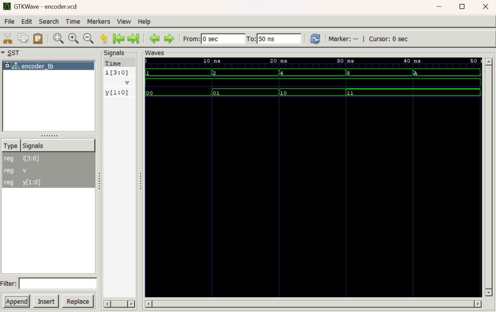
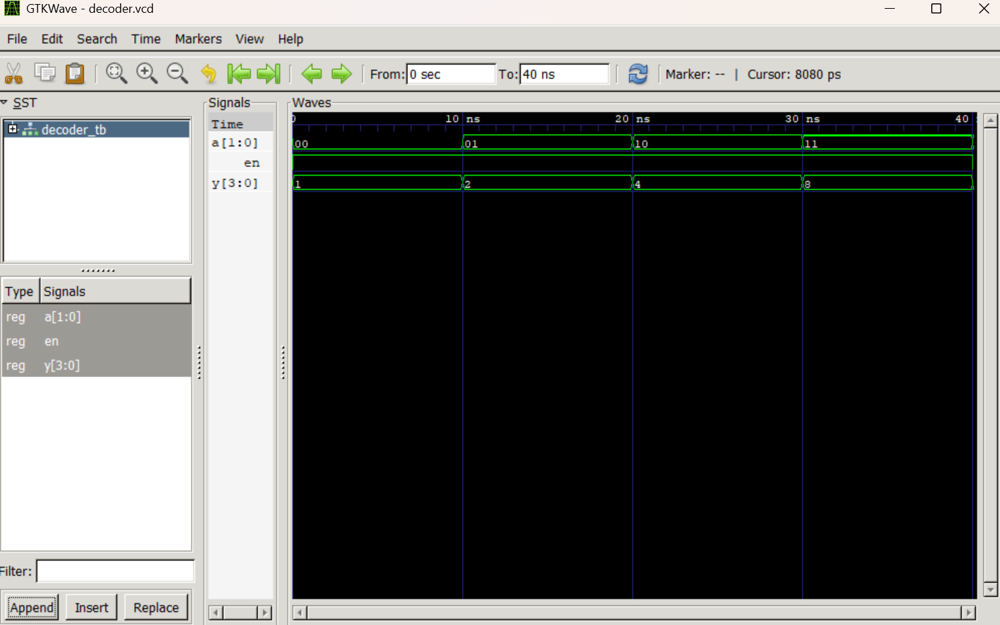

# Lab 3: VHDL Code for Combinational Circuits (Encoder and Decoder)

## Course Information

- **Course:** Computer Architecture (CMP 262)
- **Program:** Bachelor of Computer Engineering
- **Semester:** Fourth Semester
- **College:** Cosmos College of Management and Technology
- **Department:** Information and Communication Technology

---

# Aim

- To design and simulate a 4-to-2 priority encoder using VHDL.
- To design and simulate a 2-to-4 decoder using VHDL.
- To understand the operation of combinational circuits.
- To verify circuit functionality using GHDL and GTKWave.

---

# Introduction

## Overview of Combinational Circuits

Combinational circuits are digital circuits whose outputs depend only on present input values. These circuits do not use memory elements or clock signals.

Two important combinational circuits are:

- **Encoder**
- **Decoder**

These circuits are widely used in digital systems, communication systems, memory addressing, and data processing applications.

---

# Encoder

An encoder converts multiple input lines into a smaller number of binary output lines.

A **4-to-2 priority encoder** has:

- 4 input lines (`I0` to `I3`)
- 2 output lines (`Y1Y0`)
- 1 valid output (`V`)

The priority encoder gives priority to the highest-numbered active input when multiple inputs are HIGH simultaneously.

---

# Truth Table: 4-to-2 Priority Encoder

| I3 | I2 | I1 | I0 | Y1 | Y0 |
|----|----|----|----|----|----|
| 0 | 0 | 0 | 1 | 0 | 0 |
| 0 | 0 | 1 | X | 0 | 1 |
| 0 | 1 | X | X | 1 | 0 |
| 1 | X | X | X | 1 | 1 |

---

# Decoder

A decoder converts binary input data into one active output line.

A **2-to-4 decoder** has:

- 2 input lines (`A1A0`)
- 4 output lines (`Y0` to `Y3`)
- 1 enable signal (`EN`)

Only one output becomes HIGH at a time depending on the binary input.

---

# Truth Table: 2-to-4 Decoder

| A1 | A0 | Y3 | Y2 | Y1 | Y0 |
|----|----|----|----|----|----|
| 0 | 0 | 0 | 0 | 0 | 1 |
| 0 | 1 | 0 | 0 | 1 | 0 |
| 1 | 0 | 0 | 1 | 0 | 0 |
| 1 | 1 | 1 | 0 | 0 | 0 |

---

# Basic Components of a VHDL Program

A standard VHDL design mainly consists of the following sections:

| Component | Purpose |
|-----------|---------|
| **Library Declaration** | Imports predefined packages and data types |
| **Entity** | Defines the input and output ports |
| **Architecture** | Describes the internal logic |

---

# Libraries Used

The IEEE library provides standard logic data types used in VHDL design.

```vhdl
library IEEE;
use IEEE.STD_LOGIC_1164.ALL;
```

## Description

- `STD_LOGIC_1164` provides the `std_logic` and `std_logic_vector` data types.

---

# Architecture Style

The **Behavioral modeling style** is used in this experiment.

Behavioral modeling describes circuit operation using processes, conditional statements, and case statements.

---

# VHDL Simulation Procedure

The VHDL development process generally includes:

1. Writing the VHDL source code
2. Compiling the design
3. Elaborating the testbench
4. Running simulation
5. Viewing waveforms using GTKWave

---

# GHDL Commands

## Encoder Simulation

```bash
# Compile encoder and testbench
ghdl -a encoder_4to2.vhd encoder_tb.vhd

# Elaborate testbench
ghdl -e ENCODER_TB

# Run simulation
ghdl -r ENCODER_TB --vcd=encoder.vcd

# Open waveform viewer
gtkwave encoder.vcd
```

---

## Decoder Simulation

```bash
# Compile decoder and testbench
ghdl -a decoder_2to4.vhd decoder_tb.vhd

# Elaborate testbench
ghdl -e DECODER_TB

# Run simulation
ghdl -r DECODER_TB --vcd=decoder.vcd

# Open waveform viewer
gtkwave decoder.vcd
```

---

# Design Description

## File: `encoder_4to2.vhd`

The design implements a 4-to-2 priority encoder. The highest-priority active input is converted into a 2-bit binary output.

## VHDL Code

```vhdl
library IEEE;
use IEEE.STD_LOGIC_1164.ALL;

entity ENCODER_4TO2 is
    port (
        I : in std_logic_vector(3 downto 0);
        Y : out std_logic_vector(1 downto 0);
        V : out std_logic
    );
end entity ENCODER_4TO2;

architecture Behavioral of ENCODER_4TO2 is
begin

    process(I)
    begin

        V <= '1';

        if I(3) = '1' then
            Y <= "11";

        elsif I(2) = '1' then
            Y <= "10";

        elsif I(1) = '1' then
            Y <= "01";

        elsif I(0) = '1' then
            Y <= "00";

        else
            Y <= "00";
            V <= '0';

        end if;

    end process;

end architecture Behavioral;
```

---

# Testbench Description

## File: `encoder_tb.vhd`

The testbench applies different input combinations to verify the operation of the priority encoder.

## Testbench Code

```vhdl
library IEEE;
use IEEE.STD_LOGIC_1164.ALL;

entity ENCODER_TB is
end entity ENCODER_TB;

architecture Simulation of ENCODER_TB is

    signal I : std_logic_vector(3 downto 0) := "0000";
    signal Y : std_logic_vector(1 downto 0);
    signal V : std_logic;

begin

    DUT : entity work.ENCODER_4TO2
        port map (
            I => I,
            Y => Y,
            V => V
        );

    STIMULUS : process
    begin

        I <= "0001";
        wait for 10 ns;

        I <= "0010";
        wait for 10 ns;

        I <= "0100";
        wait for 10 ns;

        I <= "1000";
        wait for 10 ns;

        I <= "1010";
        wait for 10 ns;

        I <= "0000";
        wait for 10 ns;

        wait;

    end process;

end architecture Simulation;
```

---

# Applied Inputs for Encoder

| Time | Input (`I`) | Output (`Y`) |
|------|-------------|---------------|
| 0 ns | `"0001"` | `"00"` |
| 10 ns | `"0010"` | `"01"` |
| 20 ns | `"0100"` | `"10"` |
| 30 ns | `"1000"` | `"11"` |
| 40 ns | `"1010"` | `"11"` |
| 50 ns | `"0000"` | Invalid (`V='0'`) |

---

# Design Description

## File: `decoder_2to4.vhd`

The design implements a 2-to-4 decoder with an enable signal.

## VHDL Code

```vhdl
library IEEE;
use IEEE.STD_LOGIC_1164.ALL;

entity DECODER_2TO4 is
    port (
        A  : in std_logic_vector(1 downto 0);
        EN : in std_logic;
        Y  : out std_logic_vector(3 downto 0)
    );
end entity DECODER_2TO4;

architecture Behavioral of DECODER_2TO4 is
begin

    process(A, EN)
    begin

        if EN = '1' then

            case A is

                when "00" =>
                    Y <= "0001";

                when "01" =>
                    Y <= "0010";

                when "10" =>
                    Y <= "0100";

                when "11" =>
                    Y <= "1000";

                when others =>
                    Y <= "0000";

            end case;

        else

            Y <= "0000";

        end if;

    end process;

end architecture Behavioral;
```

---

# Testbench Description

## File: `decoder_tb.vhd`

The testbench verifies the functionality of the decoder using different input combinations.

## Testbench Code

```vhdl
library IEEE;
use IEEE.STD_LOGIC_1164.ALL;

entity DECODER_TB is
end entity DECODER_TB;

architecture Simulation of DECODER_TB is

    signal A  : std_logic_vector(1 downto 0) := "00";
    signal EN : std_logic := '1';
    signal Y  : std_logic_vector(3 downto 0);

begin

    DUT : entity work.DECODER_2TO4
        port map (
            A  => A,
            EN => EN,
            Y  => Y
        );

    STIMULUS : process
    begin

        EN <= '1';

        A <= "00";
        wait for 10 ns;

        A <= "01";
        wait for 10 ns;

        A <= "10";
        wait for 10 ns;

        A <= "11";
        wait for 10 ns;

        EN <= '0';
        A <= "10";
        wait for 10 ns;

        wait;

    end process;

end architecture Simulation;
```

---

# Applied Inputs for Decoder

| Time | EN | Input (`A`) | Output (`Y`) |
|------|----|-------------|---------------|
| 0 ns | 1 | `"00"` | `"0001"` |
| 10 ns | 1 | `"01"` | `"0010"` |
| 20 ns | 1 | `"10"` | `"0100"` |
| 30 ns | 1 | `"11"` | `"1000"` |
| 40 ns | 0 | `"10"` | `"0000"` |

---

# Simulation Output

## File: `encoder.vcd`

The simulation generates a VCD file containing signal transitions for the encoder circuit.

---

# Encoder Waveform



### Encoder Result

The waveform confirms that the encoder correctly produces binary outputs according to the highest-priority active input.

---

# Decoder Waveform



### Decoder Result

The waveform confirms that only one output line becomes HIGH depending on the binary input when the enable signal is active.

---

# Tools Used

| Tool | Purpose |
|------|---------|
| **VS Code** | Writing and editing VHDL code |
| **GHDL** | Compiling and simulating VHDL programs |
| **GTKWave** | Viewing waveform output |

---

# Conclusion

In this laboratory exercise, a 4-to-2 priority encoder and a 2-to-4 decoder were successfully designed and simulated using VHDL. The Behavioral modeling style was used to describe the combinational circuit operations using processes and conditional statements. The designs were compiled and simulated using GHDL, and the generated waveforms were analyzed using GTKWave. The observed outputs matched the expected truth tables, verifying the correct operation of both circuits. This experiment provided practical understanding of combinational logic design and VHDL simulation flow.